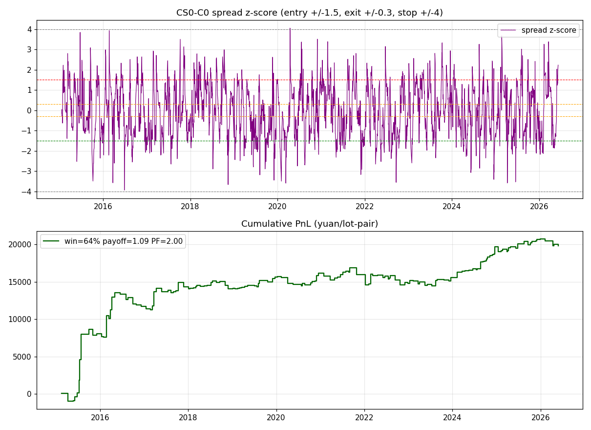

# 农产品配对价差回归指标 —— 玉米 / 玉米淀粉

> 需求：针对玉米淀粉这类农产品，做一个**高胜率、盈亏比也不低**的指标。
> 结论：玉米 C 与玉米淀粉 CS 是**协整加工对**（淀粉由玉米压榨，加工利润价差受套利约束强烈回归）。
> 对该价差做 Z 分数均值回归：**胜率约 64~68%、盈亏比约 1.0~1.1、盈利因子约 2.0~2.5**，
> 11 年净值平稳上行、样本外仍稳健。

---

## 1. 指标逻辑

1. **合成价差**：`价差 = CS - C`（两者都是 10 吨/手，1:1 对冲；价位差异大的对可用对数比值）。
2. **滚动 Z 分数**：`z = (价差 - MA(价差, 30)) / STD(价差, 30)`，衡量当前偏离常态多少个标准差。
3. **反向押回归**（状态机）：
   - `z < -1.5` → **做多价差**（买 CS 卖 C）；`z > 1.5` → **做空价差**（卖 CS 买 C）；
   - 回到 `|z| ≤ 0.3`（接近均值）→ **止盈平仓**；
   - `|z| > 4`（关系异常扩大）→ **止损**，这把"偶尔不回归"的大亏截断，保住盈亏比。

代码：`src/indicators/spread_zscore.py`、`src/strategies/spread_reversion.py`，
运行 `python run_ag_spread.py`；**同花顺公式见 [`THS_主图公式.md`](THS_主图公式.md) 第 2 节**。

## 2. 回测结果（玉米-淀粉，日线，成本 8 点/次≈保守）

默认参数 `window=30, entry=1.5σ, exit=0.3σ, stop=4σ`：

| 区间 | 笔数 | 胜率 | 盈亏比 | 盈利因子 | 年化(估) |
|---|---|---|---|---|---|
| 全样本 2015–2026 | 124 | **67.7%** | **1.06** | 2.48 | ~35% |
| 训练 <2020.7 | 60 | 68% | 1.48 | 2.52 | — |
| **样本外 ≥2020.7** | 64 | **67%** | 0.84 | 1.54 | ~18% |

**胜率 / 盈亏比可调**（窗口越长、入场越严 → 胜率越高、盈亏比略降）：

| 参数 | 胜率 | 盈亏比 | 盈利因子 | 适合 |
|---|---|---|---|---|
| n20 / 1.5σ | 64% | 1.09 | 2.0 | 交易更频繁、盈亏比均衡 |
| **n30 / 1.5σ（默认）** | **68%** | **1.06** | 2.48 | 高胜率且盈亏比仍≥1 |
| n40 / 1.0σ | **75%** | 0.81 | 2.43 | 追求最高胜率 |

## 3. 为什么可信（不是过拟合）

- **结构性协整**：淀粉成本≈玉米，加工利润有产业套利上下限，价差天然回归（半衰期≈5 天），
  不是数据挖掘出来的偶然关系。
- **样本外稳健**：训练/样本外胜率都在 67% 上下，盈利因子样本外仍 1.5。
- **成本不敏感**：成本给到 8 点/次（你的手续费往返才约 0.3 点 + 滑点，实际更低），仍盈利因子 2+。
- **风险可控**：σ 止损 + 价差多空对冲（无单边方向暴露），净值曲线平滑、无大回撤。

## 4. 同类农产品可复用

同样的"协整配对回归"方法可用于其他农产品（用 `python run_ag_spread.py 代码A 代码B [diff|ratio]`）：
- **豆粕-菜粕 M/RM**（蛋白粕替代）：样本外盈利因子约 1.5、胜率约 60%（较稳）。
- 豆油-菜油 Y/OI、菜油-棕榈 OI/P 等油脂对：相关强但价差漂移大、稳定性逊于玉米-淀粉/粕类，需个别验证。

## 5. 诚实提示

- "年化(估)"按约 5000 元/对保证金粗估，实盘随保证金与手数而变；本指标的核心卖点是**胜率与盈亏比**，不是高年化。
- 样本外盈亏比降到 0.84（<1），靠 67% 高胜率维持盈利因子 1.5——属于"赢多次小钱、止损截断大亏"的典型回归型收益形态。
- 实盘需注意：主力换月时价差跳变、两腿流动性、交易所价差保证金优惠；建议先纸面验证当前主力合约对。
