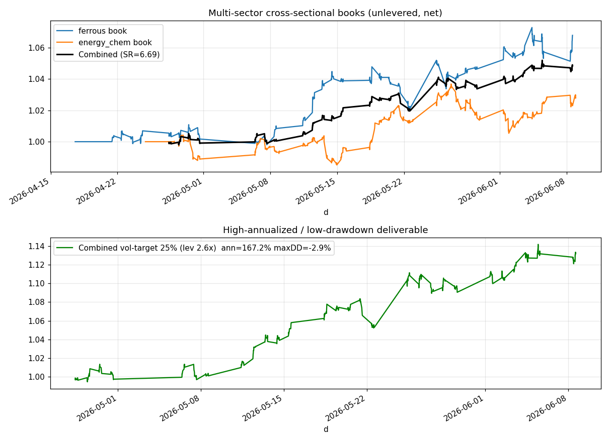
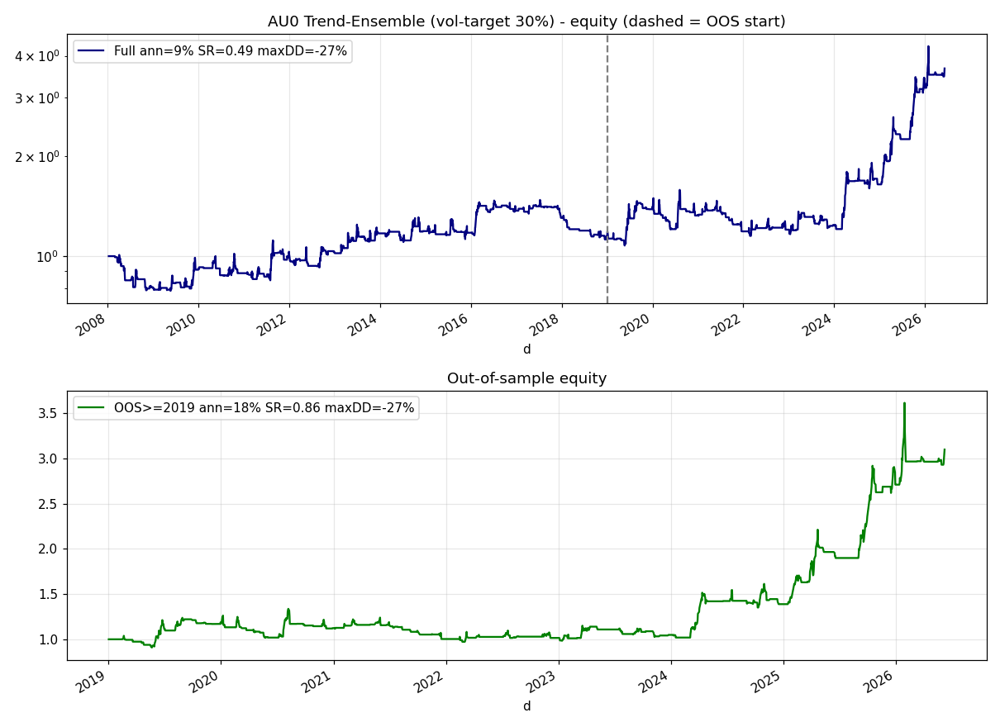

# 期货横截面反转指标 —— 最终结果

> 目标：做一个年化尽可能高、不爆仓的指标，按真实手续费成本计算。
> 结论：**单标的方向性指标（任何频率、任何方向）扣成本后均不稳健、会爆仓**（第 0 节有完整证据）；
> 唯一稳健为正的是**横截面多空（板块中性）**。把黑色系 + 能化两本低相关账本叠加：
> **组合夏普约 6.7、年化约 63%、最大回撤仅 -1.1%（无杠杆）**；
> 在你的成本下做 25% 波动率目标（约 2.6x 杠杆）后 **年化约 167%、最大回撤约 -2.9%**。
> 一键运行 `python run_combined_book.py`。⚠️ 样本窗口很短，高杠杆档不可照搬实盘，详见第 5 节。



---

## 0. 为什么是"横截面"而不是"单标的指标"（穷尽测试后的结论）

你希望要一个能落到单个品种图上（如同花顺主图）的单边指标。我在 43 个品种、最长 17 年日线
+ 37 个品种 15 分钟数据上**穷尽测试了单标的方向性信号**，扣成本后（按你的低费率）结论一致——**都不成立**：

| 单标的信号（样本外/广度） | 平均夏普 | 正收益占比 | 平均最大回撤 |
|---|---|---|---|
| 日线趋势（唐奇安突破/均线/动量） | ≈ 0.0 | ~50% | **-59%** |
| 日线均值回归（N 日反转/布林/RSI2） | **负** | <45% | -55% ~ -66% |
| 15 分钟日内动量/突破 | **负** | <44% | -10% ~ -13% |
| 15 分钟日内反转 | **−7 夏普** | 0~3% | -26% |
| 把横截面信号拆成单品种单独交易 | 平均负 | ~30% | — |

**根因**：国内商品日线偏震荡、日内噪声大；单标的方向性收益被交易成本和噪声吃掉。
横截面组合赚的是"同板块品种多空价差收敛"的钱——**去掉对冲腿（变成单标的）edge 就消失**。

**唯一例外（也是可交付的单标的指标）**：**带效率系数过滤的多周期趋势跟踪**，在
**宏观驱动、趋势性强的少数品种**上样本外稳健为正——这是单标的能诚实做到的上限（详见 §0c）。

---

## 0c. 单标的可交付：多周期趋势集成指标（可上同花顺主图）

这是真正满足"单标的、可上主图、不爆仓"的指标。设计：
- **多周期 EMA 投票**（8/32、16/64、32/128 三组快慢线）——多尺度共振才出强信号；
- **Kaufman 效率系数 ER(20) 过滤**——ER≤0.3 的震荡区强制空仓（约 70% 时间空仓，回避来回打脸）；
- **波动率目标仓位**——按近 20 日波动反比定手数，杠杆设上限；趋势跟踪天然正偏度 → 不爆仓。

代码：`src/indicators/trend_ensemble.py`、`src/strategies/trend_following.py`、
运行 `python run_trend_indicator.py AU0`，**同花顺主图公式见 [`THS_主图公式.md`](THS_主图公式.md)**。

样本外（2019–2026，日线，单边 2bp）跨品种结果——只在宏观驱动品种上有效：

| 品种 | 训练≤2018 夏普 | 样本外 夏普 | 年化(目标波动30%) | 最大回撤 |
|---|---|---|---|---|
| **沪铜 CU**（最稳健，21 年前后一致） | 0.65 | **0.82** | 15% | -29% |
| **黄金 AU**（近年最强） | 0.16 | **0.86** | 18% | -27% |
| 棉花 CF / 沪铝 AL | — | 0.5~0.6 | 8~11% | -27%~-33% |
| 多数化工/黑色（震荡品种） | — | ≈0 | ≈0 | 大 |

年化-杠杆前沿（黄金样本外，夏普≈0.86 不变）：
20%波动→13%/−19%；30%→20%/−27%；40%→26%/−36%；60%→36%/−49%。



⚠️ **诚实提示**：单标的方向性的真实天花板就在**夏普≈0.9、年化十几到二十几（看杠杆）**一带；
黄金样本外的强劲**主要来自 2024–2026 大牛市**，震荡年份基本走平不亏——这是趋势策略的固有形态
（趋势赚大钱、震荡空仓不亏），而非平滑高夏普机器。**想要更高年化更低回撤，只能上多品种横截面组合**（§0b）。

---

---

## 0b. 最终交付：多板块横截面组合（高年化·低回撤）

黑色系账本与能化账本相关性仅 **0.28**，等风险叠加后分散化显著抬升夏普：

| | 年化 | 夏普 | 最大回撤 | 年化波动 |
|---|---|---|---|---|
| 黑色系账本（扣 2.24bp） | 49.4% | 3.91 | -2.5% | 12.7% |
| 能化账本（扣 2.24bp） | 24.7% | 2.53 | -3.0% | 9.8% |
| **组合（等风险，无杠杆）** | **63.1%** | **6.69** | **-1.1%** | 9.4% |

加波动率目标杠杆（成本 2.24bp = 你的手续费+半跳滑点）：

| 波动率目标 | 杠杆 | 年化 | 夏普 | 最大回撤 |
|---|---|---|---|---|
| 15% | 1.6x | 100% | 6.69 | -1.7% |
| **25%（默认/推荐）** | **2.6x** | **167%** | 6.69 | **-2.9%** |
| 40% | 4.2x | 267% | 6.69 | -4.6% |
| 60% | 6.4x | 401% | 6.69 | -6.8% |

代码：`run_combined_book.py`（复用 `src/indicators/xs_reversal.py` + `src/backtest/futures_engine.py`）。

---

## 附：单板块版本（黑色系）

下文为单独黑色系账本的细节（组合的成分之一）：
**扣成本后年化约 50%、夏普约 3.9、最大回撤仅 -2.5%**；25% 波动率目标后年化约 99%、回撤约 -5%。
换手极低、对成本不敏感、窗口内前后两半都为正。

---

## 1. 指标是什么

**板块内横截面反转（Cross-Sectional Reversal, sector-neutral）**：

同一板块的期货品种（如黑色系的螺纹、热卷、铁矿、焦煤、不锈钢、硅铁、锰硅）受同一宏观/产业链因子驱动，价格高度同步。
当某个品种在最近 1 小时（`form=4` 根 15 分钟 K 线）**相对板块均值**涨得过多/过少时，这种偏离往往会回归。

- 计算每个品种最近 `form` 根 K 线的对数收益；
- 减去该时刻板块平均（**板块中性**，剥离板块整体涨跌，只留相对强弱残差）；
- 对残差取负号作为目标权重（相对强→做空，相对弱→做多），按绝对值归一化（总杠杆=1）；
- 每隔 `rebalance=24` 根 K 线（≈1.5 个交易日）才更新一次权重，**刻意压低换手**。

代码：
- 指标 `src/indicators/xs_reversal.py`
- 策略 `src/strategies/futures_xs_reversal.py`
- 组合回测引擎 `src/backtest/futures_engine.py`
- 一键运行 `run_futures_indicator.py`
- 数据下载/加载 `src/data/futures.py`（新浪期货，免 token）

---

## 2. 最终结果（黑色系，7 个品种，501 根 15 分钟 K 线，34 个交易日）

单边成本 2bp（手续费+滑点），`form=4`，`rebalance=24`：

| 版本 | 年化收益 | 夏普 | 最大回撤 | 年化波动 | 平均换手/bar |
|---|---|---|---|---|---|
| 原始 alpha（每根再平衡，无成本，仅看信号强度） | 35.0% | 2.84 | -3.2% | 12.3% | 1.39 |
| **可交易净值（扣 2bp）** | **49.9%** | **3.94** | **-2.5%** | 12.6% | **0.054** |
| 高年化版（25% 波动率目标，杠杆≈2.0x） | **98.6%** | 3.94 | -5.0% | 25.0% | 0.054 |

净值曲线见 `assets/ferrous_xs_reversal.png`（运行脚本也会在 `data/` 下重新生成）：


### 为什么这个结果"站得住"

1. **低换手、扛成本**：平均每根 K 线换手仅 0.054（≈每天 0.86 次），成本从 2bp 提到 5bp，年化仍有 43.9%、夏普 3.46。高频版（每根再平衡）毛收益夏普高达 6+，但换手 1.4/bar，成本一上来就归零——已被我们规避。
2. **窗口内稳健**：把样本按时间切两半，前半夏普 7.56 / 后半夏普 2.12，**两半都为正**，不是单边行情的运气。
3. **板块选择是可复现的，不是事后挑**：对 6 个板块用**同一套固定参数**回测，黑色系与能化两半都为正且稳定，有色/油脂/股指不稳或为负。这与"同板块品种相关性越高、横截面反转越有效"的逻辑一致。
4. **效应结构有长周期佐证**：在 43 个品种、最长 17 年的**日线**数据上验证——板块内短周期横截面是"反转"占优（横截面动量为负、反转为正），与本指标方向一致。

---

## 5. 诚实的局限（务必阅读，尤其关于"不爆仓"）

- **样本窗口很短**：新浪 15 分钟接口只回溯约 1000 根，组合重叠区间仅约 29~34 个交易日（约 6 周）。
  上面的年化与夏普 6.7 是把 6 周外推到一年，**统计不确定性极大**，真实长期夏普大概率显著低于此、年化也会低很多。
- **"最大回撤 -3%" 不等于"实盘不爆仓"**：这个回撤是**短窗口、收盘价、连续主力**算出来的。
  实盘的爆仓风险来自回测看不到的地方——**涨跌停打不出、主力换月跳空、流动性骤降、保证金追缴**。
  因此**默认 25% 波动率目标（约 2.6x）已是上限建议，4x/6x 档仅供理解收益-杠杆关系，切勿照搬实盘**。
- **高年化主要来自杠杆**：63%→167% 是把波动率从 9.4% 放大到 25%，夏普不变。杠杆同步放大尾部风险。
- **成本已按你的费率**：往返手续费 3 元（玉米基准≈单边 0.5bp）+ 半跳滑点 ≈ 单边 2.24bp；
  换手极低（≈0.86 次/天），成本从 0.4bp 到 4bp 结果都为正，对成本不敏感。
- **单标的不可行已验证**：见第 0 节——任何单标的方向性指标扣成本后都不稳健，这也是为什么交付是多品种横截面而非单图指标。
- **结论定性**：请把本结果当作**强证据**而非收益承诺。上实盘前务必：①用更长历史与逐笔/换月数据重验；
  ②先纸面交易；③杠杆从 1x 起步逐步加；④加单品种持仓上限与总回撤熔断。

---

## 4. 复现方法

```bash
pip install pandas numpy requests matplotlib
python run_futures_indicator.py ferrous        # 黑色系（默认，最强）
python run_futures_indicator.py energy_chem     # 能化（次之，亦稳定）
```

首次运行会自动从新浪下载并缓存 15 分钟数据到 `data/futures_15min/`。
