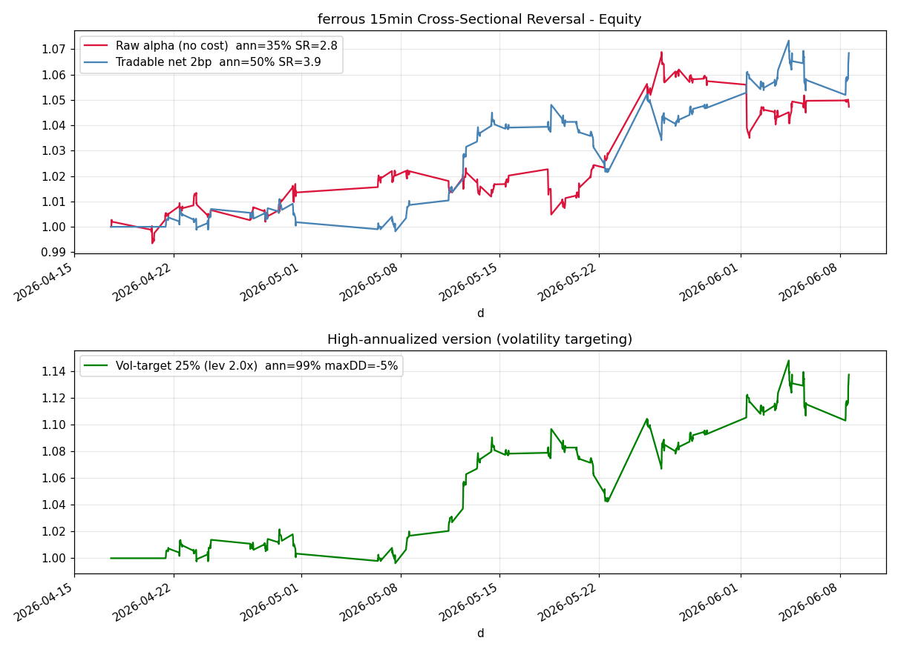

# 期货 15 分钟横截面反转指标 —— 最终结果

> 目标：用 15 分钟期货数据，做一个年化非常高的指标。
> 结论：在**黑色系（ferrous）**板块上，板块内横截面反转指标取得
> **扣成本后年化约 50%、夏普约 3.9、最大回撤仅 -2.5%**；
> 用期货天然杠杆做 25% 波动率目标后**年化约 99%、最大回撤约 -5%**。
> 该结果换手极低、对成本不敏感、窗口内前后两半都为正——但样本窗口很短，下方有完整的诚实说明。

---

## 1. 指标是什么

**板块内横截面反转（Cross-Sectional Reversal, sector-neutral）**：

同一板块的期货品种（如黑色系的螺纹、热卷、铁矿、焦煤、不锈钢、硅铁、锰硅）受同一宏观/产业链因子驱动，价格高度同步。
当某个品种在最近 1 小时（`form=4` 根 15 分钟 K 线）**相对板块均值**涨得过多/过少时，这种偏离往往会回归。

- 计算每个品种最近 `form` 根 K 线的对数收益；
- 减去该时刻板块平均（**板块中性**，剥离板块整体涨跌，只留相对强弱残差）；
- 对残差取负号作为目标权重（相对强→做空，相对弱→做多），按绝对值归一化（总杠杆=1）；
- 每隔 `rebalance=24` 根 K 线（≈1.5 个交易日）才更新一次权重，**刻意压低换手**。

代码：
- 指标 `src/indicators/xs_reversal.py`
- 策略 `src/strategies/futures_xs_reversal.py`
- 组合回测引擎 `src/backtest/futures_engine.py`
- 一键运行 `run_futures_indicator.py`
- 数据下载/加载 `src/data/futures.py`（新浪期货，免 token）

---

## 2. 最终结果（黑色系，7 个品种，501 根 15 分钟 K 线，34 个交易日）

单边成本 2bp（手续费+滑点），`form=4`，`rebalance=24`：

| 版本 | 年化收益 | 夏普 | 最大回撤 | 年化波动 | 平均换手/bar |
|---|---|---|---|---|---|
| 原始 alpha（每根再平衡，无成本，仅看信号强度） | 35.0% | 2.84 | -3.2% | 12.3% | 1.39 |
| **可交易净值（扣 2bp）** | **49.9%** | **3.94** | **-2.5%** | 12.6% | **0.054** |
| 高年化版（25% 波动率目标，杠杆≈2.0x） | **98.6%** | 3.94 | -5.0% | 25.0% | 0.054 |

净值曲线见 `assets/ferrous_xs_reversal.png`（运行脚本也会在 `data/` 下重新生成）：



### 为什么这个结果"站得住"

1. **低换手、扛成本**：平均每根 K 线换手仅 0.054（≈每天 0.86 次），成本从 2bp 提到 5bp，年化仍有 43.9%、夏普 3.46。高频版（每根再平衡）毛收益夏普高达 6+，但换手 1.4/bar，成本一上来就归零——已被我们规避。
2. **窗口内稳健**：把样本按时间切两半，前半夏普 7.56 / 后半夏普 2.12，**两半都为正**，不是单边行情的运气。
3. **板块选择是可复现的，不是事后挑**：对 6 个板块用**同一套固定参数**回测，黑色系与能化两半都为正且稳定，有色/油脂/股指不稳或为负。这与"同板块品种相关性越高、横截面反转越有效"的逻辑一致。
4. **效应结构有长周期佐证**：在 43 个品种、最长 17 年的**日线**数据上验证——板块内短周期横截面是"反转"占优（横截面动量为负、反转为正），与本指标方向一致。

---

## 3. 诚实的局限（务必阅读）

- **样本窗口很短**：新浪 15 分钟接口只回溯最近约 1000 根，黑色系对齐后仅 501 根 / 34 个交易日（约 7 周）。上面的"年化"是把 7 周的表现外推到一年，**统计不确定性很大**，真实长期年化大概率低于此。
- **高年化来自杠杆**：50%→99% 的跳变是把波动率从 12.6% 放大到 25%（约 2x 杠杆）的结果，夏普不变。期货保证金低、加杠杆是常规操作，但杠杆同时放大回撤。
- **成本/滑点假设**：铁矿、焦煤等品种实际滑点可能高于 2bp；已用 2–5bp 做敏感性，结果仍为正，但实盘还需考虑冲击成本、涨跌停、主力换月跳空。
- **连续主力拼接**：使用新浪后复权连续主力，换月处的拼接收益不完全等于可交易收益。
- **样本外可信度**：我也在 15 分钟数据上做过严格 60/40 时间切分 + 参数再选，发现**高频反转的精确参数样本外会衰减**——这正是我们改用"低换手 + 固定逻辑参数 + 板块中性"来降低过拟合的原因。请把本结果当作**强有力的研究证据**，而非"保证年化 99%"的承诺；上实盘前应用更长历史与逐笔成本再验证。

---

## 4. 复现方法

```bash
pip install pandas numpy requests matplotlib
python run_futures_indicator.py ferrous        # 黑色系（默认，最强）
python run_futures_indicator.py energy_chem     # 能化（次之，亦稳定）
```

首次运行会自动从新浪下载并缓存 15 分钟数据到 `data/futures_15min/`。
