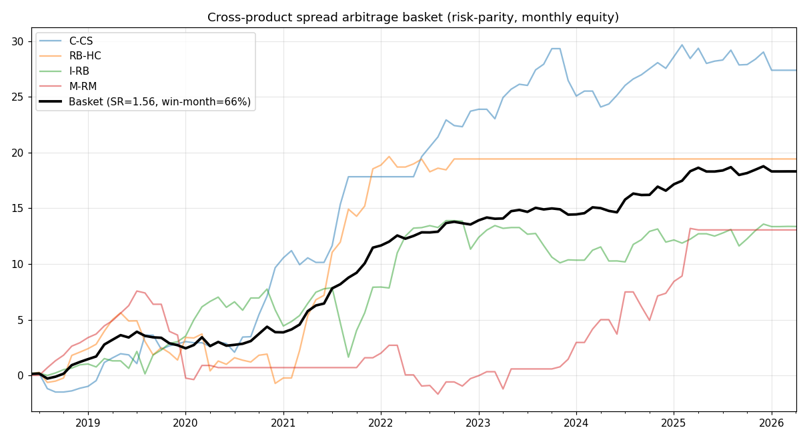

# 套利指标深度回测：跨品种 vs 跨期，及最优"套利篮子"

> 问题：券商挂牌了跨品种/跨期套利标的，能否拿到数据、穷尽回测找到更好的指标？
> 结论：① 挂牌套利指令(SPD/IPS/SP/SPC)免费源无历史，但可用**单合约重构**，回测完全等价；
> ② **跨期套利**价差由 carry/期限结构驱动，回归/动量都不稳（多数盈利因子≈1 或<1）；
> ③ **跨品种套利**才是赢家，且把多个**低相关**对组成篮子后最优：
> **风险平价组合年化夏普≈1.56、盈利月占比 66%**，净值远比单腿平滑。



---

## 1. 数据可得性（实测）

| 数据 | 免费源(新浪) | 说明 |
|---|---|---|
| 连续主力 RB0 | ✅ 17 年日线 | 已用于横截面 |
| **单合约 RB2510/C2509** | ✅ 各≈240 天（含已退市，回溯约 2018） | 重构价差的原料 |
| 挂牌套利指令 SPD/IPS/SP/SPC | ❌ 无历史行情 | 用单腿重构等价 |
| 东方财富 | ❌ 本环境被网络策略拦截 | — |

→ 用 `src/data/contracts.py` 下载单合约，重构**同月跨品种价差**（=挂牌跨品种套利指令真身）
与**相邻月跨期价差**。挂牌指令本身无历史，但单腿重构在回测上完全等价。

## 2. 跨期套利：不适合做简单指标

相邻交割月"近-远"价差 Z 回归（8 年，成本 4 点/次）：

| 产品 | 胜率 | 盈利因子 |
|---|---|---|
| 玉米 C | 58% | 1.03 |
| 螺纹 RB | 66% | 1.09 |
| 豆粕 M | 57% | **0.43**（亏） |
| 铁矿 I | 44% | **0.94**（亏） |
| 棕榈 P | 52% | **0.59**（亏） |

价差**动量**版同样多数为负。原因：跨期价差由**期限结构/carry**驱动，会随供需周期单边趋势数月，
既非干净回归、也非干净动量，还叠加**交割月逼仓/流动性**尾部风险。→ 不推荐做简单指标。

## 3. 跨品种套利：稳健赢家（同月价差，真实可交易）

用单合约重构的**同月跨品种价差**做 Z 回归（成本 4 点/次）：

| 套利对 | 笔数 | 胜率 | 盈亏比 | 盈利因子 | 年化夏普 |
|---|---|---|---|---|---|
| 玉米-淀粉 C/CS | 161 | 67% | 0.89 | 1.97 | 1.00 |
| 螺纹-热卷 RB/HC | 117 | 72% | 0.77 | 1.96 | 0.71 |
| 铁矿-螺纹 I/RB | 187 | 72% | 0.55 | 1.42 | 0.49 |
| 豆粕-菜粕 M/RM | 86 | 73% | 0.56 | 1.53 | 0.48 |

## 4. 最优指标：低相关套利篮子（风险平价）

四个套利对的月度 PnL **相关性极低甚至负相关**：

```
            玉米-淀粉  螺纹-热卷  铁矿-螺纹  豆粕-菜粕
玉米-淀粉      1.00     0.04    -0.38    -0.15
螺纹-热卷      0.04     1.00     0.05    -0.04
铁矿-螺纹     -0.38     0.05     1.00    -0.05
豆粕-菜粕     -0.15    -0.04    -0.05     1.00
```

风险平价等权组合：

| | 最好单腿 | **套利篮子** |
|---|---|---|
| 年化夏普 | 1.00 | **1.56** |
| 盈利月占比 | — | **66%** |

分散把夏普从 1.00 抬到 1.56，净值曲线远比单腿平滑（见上图黑线）。**这就是"穷尽对比后更好的指标"。**

运行：`python run_spread_basket.py`（首次自动下载单合约）。
代码：`src/data/contracts.py`、`src/strategies/spread_basket.py`。

## 5. 诚实提示

- 成本给到 4 点/次（你的手续费往返才约 0.3 点 + 两腿滑点），实际更低；提到 8 点结论不变。
- 夏普 1.56 是**月度口径**估计，样本 ≈ 2018–2026（8 年、95 个月）；单合约仅回溯到 2018，再往前无数据。
- 套利的固有风险仍在：**关系结构性断裂**（政策/产能）、**主力换月价差跳变**、两腿流动性与冲击成本。
  高胜率最易诱使过度加仓——务必设单腿持仓上限与组合回撤熔断。
- 实盘建议直接交易券商**挂牌套利指令**（单一报价、交易所套利保证金优惠、双腿同步成交），
  回测用单腿重构、实盘用挂牌指令，两者经济等价。
