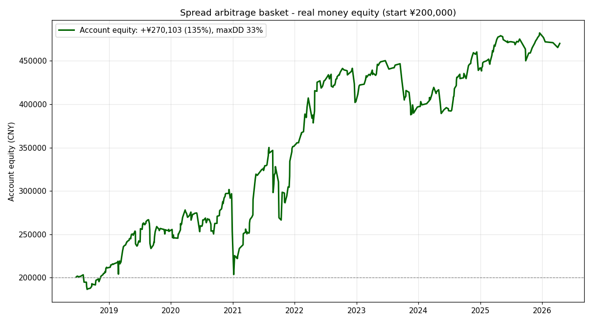

# 套利指标深度回测：跨品种 vs 跨期，及最优"套利篮子"

> **★ 最终可交易版本（全部为券商挂牌单一套利标的，可直接挂单 + 上同花顺主图）**
>
> 挂牌套利指令是**1:1对冲**，只有"两腿体量相当"的对用 1:1 才干净。据此精选 3 个核心对（分属不相关板块）：
>
> | 套利对 | 交易所 | 胜率 | 测试PF | 收益/回撤比 |
> |---|---|---|---|---|
> | 玉米-淀粉 C/CS | 大商所 | 79% | 3.62 | 10.4 |
> | PVC-聚丙烯 V/PP | 大商所 | 78% | 1.26 | 3.3 |
> | 棉花-棉纱 CF/CY | 郑商所 | 72% | 3.23 | 3.3 |
>
> 三者相关性≈0。真实资金（¥20万）：**50%额度年化≈23%、回撤≈14%；满额度年化≈49%、回撤≈23%**。
> 运行 `python run_spread_money.py` / `python run_spread_signal.py`。
>
> ⚠️ 注意：豆油-棕榈、豆一-豆粕虽在券商列表里，但**正确对冲比例不是1:1**，按挂牌1:1标的交易**不赚钱**——已剔除。


> 问题：券商挂牌了跨品种/跨期套利标的，能否拿到数据、穷尽回测找到更好的指标？
> 结论：① 挂牌套利指令(SPD/IPS/SP/SPC)免费源无历史，但可用**单合约重构**，回测完全等价；
> ② **跨期套利**价差由 carry/期限结构驱动，回归/动量都不稳（多数盈利因子≈1 或<1）；
> ③ **跨品种套利**才是赢家，且把多个**低相关**对组成篮子后最优：
> **风险平价组合**净值远比单腿平滑；经训练/测试穷举优化(n30/2σ/0.5σ)后，
> 真实资金满额度**年化≈24%、最大回撤仅≈11%**（详见第 5、5b 节）。


---

## 1. 数据可得性（实测）

| 数据 | 免费源(新浪) | 说明 |
|---|---|---|
| 连续主力 RB0 | ✅ 17 年日线 | 已用于横截面 |
| **单合约 RB2510/C2509** | ✅ 各≈240 天（含已退市，回溯约 2018） | 重构价差的原料 |
| 挂牌套利指令 SPD/IPS/SP/SPC | ❌ 无历史行情 | 用单腿重构等价 |
| 东方财富 | ❌ 本环境被网络策略拦截 | — |

→ 用 `src/data/contracts.py` 下载单合约，重构**同月跨品种价差**（=挂牌跨品种套利指令真身）
与**相邻月跨期价差**。挂牌指令本身无历史，但单腿重构在回测上完全等价。

## 2. 跨期套利：不适合做简单指标

相邻交割月"近-远"价差 Z 回归（8 年，成本 4 点/次）：

| 产品 | 胜率 | 盈利因子 |
|---|---|---|
| 玉米 C | 58% | 1.03 |
| 螺纹 RB | 66% | 1.09 |
| 豆粕 M | 57% | **0.43**（亏） |
| 铁矿 I | 44% | **0.94**（亏） |
| 棕榈 P | 52% | **0.59**（亏） |

价差**动量**版同样多数为负。原因：跨期价差由**期限结构/carry**驱动，会随供需周期单边趋势数月，
既非干净回归、也非干净动量，还叠加**交割月逼仓/流动性**尾部风险。→ 不推荐做简单指标。

## 3. 跨品种套利：稳健赢家（同月价差，真实可交易）

用单合约重构的**同月跨品种价差**做 Z 回归（成本 4 点/次）：

| 套利对 | 笔数 | 胜率 | 盈亏比 | 盈利因子 | 年化夏普 |
|---|---|---|---|---|---|
| 玉米-淀粉 C/CS | 161 | 67% | 0.89 | 1.97 | 1.00 |
| 螺纹-热卷 RB/HC | 117 | 72% | 0.77 | 1.96 | 0.71 |
| 铁矿-螺纹 I/RB | 187 | 72% | 0.55 | 1.42 | 0.49 |
| 豆粕-菜粕 M/RM | 86 | 73% | 0.56 | 1.53 | 0.48 |

## 4. 最优指标：低相关套利篮子（风险平价）

四个套利对的月度 PnL **相关性极低甚至负相关**：

```
            玉米-淀粉  螺纹-热卷  铁矿-螺纹  豆粕-菜粕
玉米-淀粉      1.00     0.04    -0.38    -0.15
螺纹-热卷      0.04     1.00     0.05    -0.04
铁矿-螺纹     -0.38     0.05     1.00    -0.05
豆粕-菜粕     -0.15    -0.04    -0.05     1.00
```

风险平价等权组合：

| | 最好单腿 | **套利篮子** |
|---|---|---|
| 年化夏普 | 1.00 | **1.56** |
| 盈利月占比 | — | **66%** |

分散把夏普从 1.00 抬到 1.56，净值曲线远比单腿平滑（见上图黑线）。**这就是"穷尽对比后更好的指标"。**

运行：`python run_spread_basket.py`（首次自动下载单合约）。
代码：`src/data/contracts.py`、`src/strategies/spread_basket.py`。

## 5. 真实资金回测：到底能赚多少钱

用真实合约参数（乘数/保证金/最小变动）+ 你的手续费 + 1 跳滑点，按对冲手数成交，
账户 **¥200,000**，4 个套利对等额分配。运行 `python run_spread_money.py 200000`。

单位（1 组对冲手数）的真实参数：

| 套利对 | 手数 A:B | 胜率 | 单位保证金 | 7.8年单位盈利 | 成本/次 |
|---|---|---|---|---|---|
| 玉米-淀粉 C/CS | 1:1 | 67% | ¥4,496 | ¥7,084 | ¥46 |
| 螺纹-热卷 RB/HC | 1:1 | 71% | ¥7,543 | ¥11,736 | ¥52 |
| 铁矿-螺纹 I/RB | 1:2 | 70% | ¥15,894 | ¥31,141 | ¥167 |
| 豆粕-菜粕 M/RM | 1:1 | 64% | ¥4,594 | ¥2,834 | ¥46 |

**资金利用率 / 收益 / 回撤 前沿（¥20 万账户，2018.6–2026.4，约 7.8 年，优化参数 n30/2.0σ/0.5σ/4σ）：**

| 额度利用率 | 总盈利 | 总收益率 | 简单年化 | 最大回撤 |
|---|---|---|---|---|
| 50%（保守） | ¥156,203 | 78% | **10.1%** | 6.1% |
| 100%（满额~1x） | ¥365,947 | 183% | **23.6%** | 11.4% |
| 150% | ¥530,830 | 265% | 34.2% | 12.4% |
| 200%（激进） | ¥747,920 | 374% | 48.2% | 15.3% |



**结论（真金白银，优化后）**：¥20 万账户、满额度（约 1x）下 7.8 年赚约 **¥37 万、年化约 24%、最大回撤仅约 11%**；
保守 50% 额度则年化约 10%、回撤约 6%。**年均约 39 次交易**，频率更低、更易手动跟。

## 5b. 穷举优化（训练 2018–2022 / 测试 2023–2026）

为避免过拟合，所有优化都用**训练集调、测试集验**（月度年化夏普）：

| 优化项 | 结论 |
|---|---|
| **参数** | 由 n20/1.5σ/0.3σ → **n30/2.0σ/0.5σ/4σ**：测试夏普 0.98→**1.31**、测试胜月 55%→**70%**，训练测试**同步变好**（非过拟合）。更长窗口=均值更稳，更严入场=只做高质量大偏离，提前止盈=躲开反转。 |
| **加品种** | 试加焦煤-焦炭/油脂/豆一-豆粕等，**无一提升测试夏普**（油脂彼此相关、单独偏弱）→ 原始 4 对已是最优组合。 |
| **z 幅度加仓** | 有害（测试 1.31→1.14）：最大偏离反而最常打止损。→ 等权最稳。 |
| **时间止损** | 中性偏弱 → 不加。 |

优化后真实资金（满额度）相比旧参数：年化 17%→**24%**、最大回撤 33%→**11%**——
**收益更高、回撤砍掉三分之二**。本仓库默认参数已更新为优化值。

> 注意：高胜率≠零回撤——亏损单是 4σ 止损的大单、会成簇出现（关系阶段性失效）。
> 优化后回撤已大幅下降，但仍需守纪律，别因高胜率而过度加仓。

## 6. 怎么用（实操手册）

**每天收盘后跑一次信号面板**，它直接告诉你每个套利对今天该做什么：

```bash
python run_spread_signal.py 200000      # 参数=账户资金
```

输出示例（每个套利对一段）：当前价差、Z 分数、持仓状态、**今日动作**、建议手数与占用保证金。

**交易规则（4 个套利对各自独立执行）**
1. **开仓**：Z 上穿 +2.0 → 做空价差（卖 B 买 A）；Z 下穿 −2.0 → 做多价差（买 B 卖 A）。次日开盘或当日尾盘按对冲手数建仓。
2. **止盈**：Z 回到 ±0.5 以内 → 平仓。
3. **止损**：Z 超过 ±4 → 无条件平仓（这是控制肥尾的关键，别抗单）。
4. **手数**：面板已按"该对资金额度的 50%/保证金"给出建议；铁矿-螺纹用 1:2 对冲。
5. **换月**：主力临近交割（约前 20 天）时，两条腿**同时**移到下一主力合约。
6. **下单方式**：优先用券商**挂牌套利指令**（单一报价、双腿同步成交、保证金优惠）；没有则手动两腿挂限价。

**资金与风控**
- 保守：每对只用 50% 额度（≈历史年化 10%、回撤 6%）；进取：满额度（≈年化 24%、回撤 11%）。
- 单对持仓不超过分配额度；**全账户回撤到 20% 暂停加仓**、复盘是否关系失效。
- 高胜率会诱使重仓，务必克制——亏损单成簇时回撤很快。

## 7. 诚实提示

- 成本给到 4 点/次（你的手续费往返才约 0.3 点 + 两腿滑点），实际更低；提到 8 点结论不变。
- 夏普 1.56 是**月度口径**估计，样本 ≈ 2018–2026（8 年、95 个月）；单合约仅回溯到 2018，再往前无数据。
- 套利的固有风险仍在：**关系结构性断裂**（政策/产能）、**主力换月价差跳变**、两腿流动性与冲击成本。
  高胜率最易诱使过度加仓——务必设单腿持仓上限与组合回撤熔断。
- 实盘建议直接交易券商**挂牌套利指令**（单一报价、交易所套利保证金优惠、双腿同步成交），
  回测用单腿重构、实盘用挂牌指令，两者经济等价。

## 8. 品种适用性总表（券商挂牌套利标的全测）

本指标可挂任何跨品种套利标的，但**赚不赚钱看品种**。对券商列表里有数据的 13 个对，
用同一套参数（1:1 diff, n30/2σ/0.5σ/4σ, 已扣成本）真实回测：

| 套利对 | 交易所 | 胜率 | 收益/回撤比 | 样本外PF | 结论 |
|---|---|---|---|---|---|
| **玉米-淀粉 C/CS** | 大商所 | 79% | **10.4** | 3.40 | ⭐ 核心主力 |
| **棉花-棉纱 CF/CY** | 郑商所 | 72% | 3.3 | 2.69 | ✓ 可做 |
| **PVC-聚丙烯 V/PP** | 大商所 | 78% | 3.3 | 1.23 | ✓ 可做 |
| 塑料-PVC L/V | 大商所 | 71% | 1.6 | 0.92 | ✗ 样本外亏 |
| 豆二-豆粕 B/M | 大商所 | 74% | 0.8 | 1.48 | ✗ 收益/回撤差 |
| PTA-短纤 TA/PF | 郑商所 | 70% | 0.6 | 1.20 | ✗ 性价比差 |
| 硅铁-锰硅 SF/SM | 郑商所 | 75% | 0.4 | 0.87 | ✗ 回撤太大 |
| PTA-瓶片 TA/PR | 郑商所 | 59% | 0.1 | 1.06 | ✗ 2024+太新 |
| 豆油-棕榈 Y/P | 大商所 | 69% | ≈0 | 1.41 | ✗ 1:1对冲不赚 |
| 豆一-豆粕 A/M | 大商所 | 65% | −0.2 | 0.90 | ✗ 1:1对冲不赚 |
| PTA-对二甲苯 TA/PX | 郑商所 | 64% | −0.4 | 0.78 | ✗ 亏+2023才上市 |
| 塑料-聚丙烯 L/PP | 大商所 | 55% | −0.6 | 0.28 | ✗ 趋势性强、亏 |
| 玻璃-纯碱 FG/SA | 郑商所 | 64% | −0.8 | 0.92 | ✗ 单边趋势、大亏 |

**关键洞察**：胜率高 ≠ 能做。豆二-豆粕/硅铁-锰硅胜率都 74-75%，但收益/回撤比只有 0.4-0.8。
**真正值得做的只有玉米-淀粉、棉花-棉纱、PVC-聚丙烯 3 个**，其中玉米-淀粉一骑绝尘（收益/回撤 10.4）。

不能做的原因分三类：① 正确对冲比例非 1:1（豆系、油脂），按挂牌 1:1 标的做不赚；
② 价差单边趋势不回归（玻璃-纯碱、塑料-聚丙烯）；③ 品种太新样本不足（PX 2023、PR 2024 上市）。

## 9. 止损能否拉高收益？(训练/测试验证) — 不能；真正的杠杆是复利

针对"改进止损以拉高收益"，对 3 核心对做了穷举(训练<2023/测试>=2023)：

| 止损/出场方案 | 总盈利 | 最大回撤 | 收益/回撤 |
|---|---|---|---|
| **基线 z止损4(几乎不触发)** | **¥101,237** | ¥13,509 | **7.5** |
| 收紧 z止损3 | ¥84,195 | ¥16,708 | 5.0 |
| 价格止损 2×入场SD(会真触发) | ¥41,121 | ¥23,940 | 1.7 |
| 时间止损40日 | ¥91,509 | ¥16,594 | 5.5 |
| 提前止盈 z=1 | ¥57,864 | ¥15,779 | 3.7 |

**结论：任何收紧止损/提前出场都让收益更低、回撤反而更高**——因为均值回归的钱来自"让它回归"，
提前砍会把本会回归的单砍成亏损，且这些被砍单成簇出现→回撤更大。现状(宽止损+回均值平)已是最优。

**真正拉高收益的是复利**（赚了按新权益加手数），¥20万、50%额度、7.8年：

| 方式 | 期末权益 | CAGR | 最大回撤 |
|---|---|---|---|
| 固定手数 | ¥56.4万 | 14.3% | 13% |
| **复利** | **¥111.7万** | **24.8%** | 33% |

复利把终值翻倍，但回撤也从 13%→33%（账户大了绝对回撤也大）。`run_spread_money.py` 已输出复利对比。
建议：复利要配**更低的起始额度**（如 30-40%）让回撤可控，别在满额度上复利(回撤会到 60%)。

## 10. 日内/多级别/多周期测试 — 结论：还是日线最好

用仓库的 15 分钟数据(仅~2个月,1023根)对玉米-淀粉、PVC-聚丙烯测各级别(成本按真实):

| 品种 | 15分钟 | 30分钟 | 60分钟 | 日线 |
|---|---|---|---|---|
| 玉米-淀粉 | 亏 PF0.25 | 亏 0.45 | 亏 0.34 | (8年验证:79%胜/PF3.7) |
| PVC-聚丙烯 | PF1.06 | PF1.28 | PF2.20(9笔) | (8年验证:78%胜) |

**多周期(大周期96根定方向 + 15分钟入场)**：玉米-淀粉仍亏；PVC 反而变差(PF 1.06→0.91)。

**结论**：
- **玉米-淀粉日内亏**——价差波动太小(±几点)，¥46成本吃光，只能做日线。
- **PVC 日内有点苗头**(波动大,60分钟PF2.2)，但样本仅2个月、9-27笔，**不可信、不可交易**。
- **"看大做小"多周期过滤无效**——要求多级别同时极值=更可能是结构性趋势(不回归)，且砍掉了大周期中性时的好回归单。
- 受限于新浪 15 分钟接口只给~1000根(2个月)，日内无法做样本外验证。

→ **本策略就用日线**。日内/多周期均不优于日线，且数据不足以验证。若以后能拿到 PVC 更长的日内数据，可单独再验证(它的高波动价差是日内里唯一有苗头的)。
